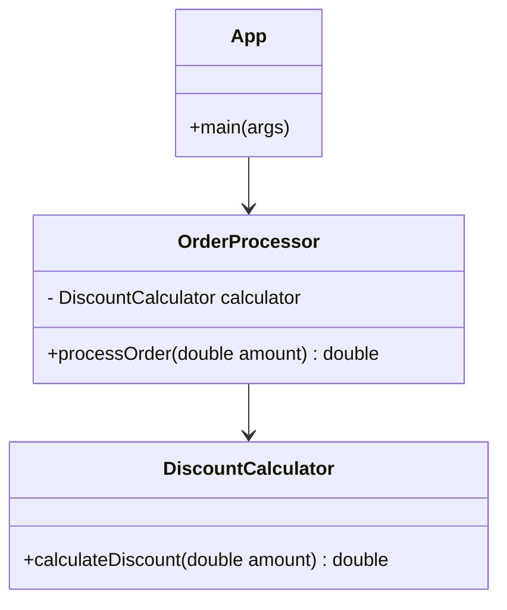

```mermaid
classDiagram
    class App {
        +main(args)
    }
    class OrderProcessor {
        - DiscountCalculator calculator
        +processOrder(double amount) double
    }
    class DiscountCalculator {
        +calculateDiscount(double amount) double
    }
    App --> OrderProcessor
    OrderProcessor --> DiscountCalculator
```